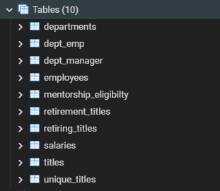
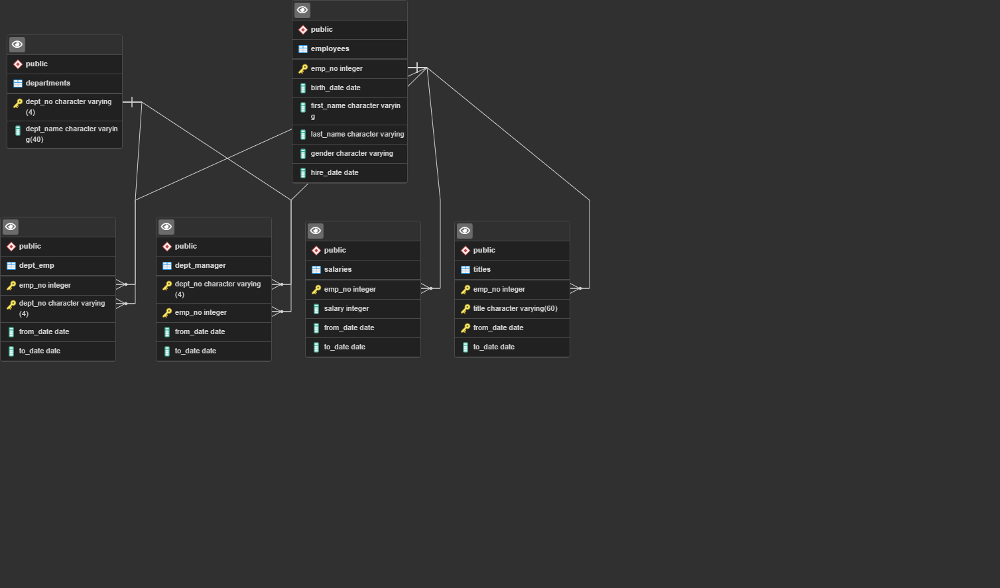
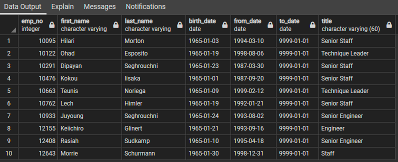
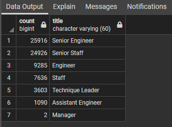
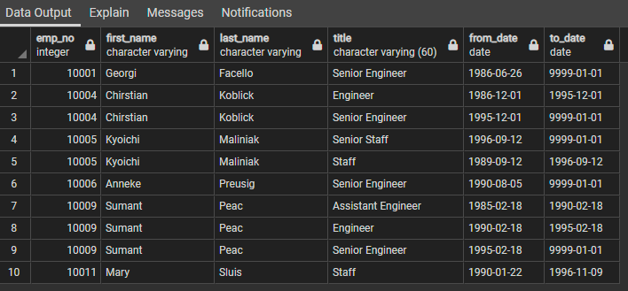

# Pewlett-Hackard-Analysis

## Overview
Bobby's manager asked that he and I complete a small project regarding the number of retiring employees. The manager asked specifically for the retiring titles, and identifying employees that are eligible to participate in a mentorship program. 

### Tables Created
We created 10 tables to define the relationships between those who are and who are not retiring. We also defined the retiring titles and identified which employees could participate in a mentorship program

This is a picture of how the different tables relate to each other. 

## Results

- **Mentorship Eligibility**

We are showing the eligible people and their title who can mentor new employees first. This is the good news. The bad news is that there are quite a few employees and titles that may be retired without intervention.

- **Retiring Titles**

There are 7 titles that will be retiring. But as you can see, there are almost 26 thousand Senior Engineers that are retiring soon, 24,000+ Senior staff... yes there are alot of positions that will need to be filled soon. 

- **Unique Titles**

This table shows a list of the unique titles that will be retiring. This is a long list of more than 5000 positions that will be retiring soon. 

- **Retirement Titles**

This is a list of the individuals that were born between 1952 and 1955. They are each beyond the 65+ retirement marker that states that they could retire at any moment. 

## Summary
It is hard to imagine that a company could have so many people that may retire within the next few years, but ours does. We need to get real serious about filling these positions. 

Some other queries that might help us are: 
- What are the age brackets per title/role in the company now? If we could have stats on this, we could find out how many positions we could back fill with people in similar roles, and have longevity in the company.

- Could we poll the current employees that are in this age bracket, to see how many will retire in the next few weeks, months, and years? That would give us more time to find replacements within the company. 